# 🐣 Chocadeira F1800 — Tecnologia Acessível no Campo

> Trabalho de Conclusão de Curso — Bacharelado Interdisciplinar em Ciência e Tecnologia  
> Universidade Federal Rural do Semi-Árido (UFERSA) — Campus Pau dos Ferros  
> **Autor:** José Veríssimo de Oliveira Queiroz  
> **Orientador:** Prof. Dr. Pedro Thiago Valério de Souza  
> **Defendido em:** 04 de agosto de 2025

---

## 📖 Sobre o Projeto

Este projeto propõe o desenvolvimento de uma **chocadeira automatizada de baixo custo** com controle térmico baseado na plataforma Arduino, voltada para atender às necessidades de pequenos produtores rurais, especialmente no contexto da agricultura familiar do semiárido nordestino.

A proposta surgiu da constatação de que cerca de 77% dos estabelecimentos agropecuários brasileiros são de base familiar (IBGE, 2022), e que chocadeiras comerciais automatizadas têm custo entre R$ 450,00 e R$ 800,00 — valor inacessível para grande parte desses produtores. O protótipo desenvolvido neste trabalho foi construído por aproximadamente **R$ 215,50**, utilizando componentes acessíveis e estrutura em madeira compensada.

Além da aplicação prática no campo, o projeto possui forte potencial educacional, podendo ser utilizado em escolas técnicas e universidades como ferramenta didática em disciplinas de eletrônica, automação e IoT.

---

## ⚙️ Funcionalidades

* Monitoramento contínuo de **temperatura** e **umidade** via sensor DHT22
* Controle automático do relé com **lógica de histerese** (liga em ≤37°C, desliga em ≥38°C)
* Exibição em tempo real no **display LCD 20x4**: temperatura, umidade, estado da lâmpada e horário
* **Contagem regressiva** dos dias até o fim da incubação (21 dias)
* Aviso de **rotação dos ovos** a cada 5 horas exibido no display
* **LEDs indicadores**: verde (lâmpada ligada), vermelho (lâmpada desligada) e amarelo (alerta de umidade fora da faixa)
* **Ovoscopia** acionada por botão físico
* Verificação de erro no sensor DHT22 e no módulo RTC com exibição de mensagem no LCD

---

## 🛠️ Hardware Utilizado

| Componente | Quantidade | Valor (R$) |
|---|---|---|
| Arduino Uno R3 | 1 | 40,00 |
| Sensor DHT22 | 1 | 21,89 |
| Ventoinha | 1 | 11,73 |
| Lâmpada Incandescente | 2 | 3,64 |
| Lâmpada LED | 1 | 12,90 |
| Bocais | 3 | 8,70 |
| Fonte Chaveada 12V | 1 | 31,15 |
| Módulo Relé 4 canais | 1 | 27,00 |
| Display LCD 20x4 | 1 | 24,00 |
| Protoboard | 1 | 12,49 |
| Plug macho | 1 | 2,00 |
| Fios 1mm² | 10m | 20,00 |
| **Total** | | **R$ 215,50** |

---

## 📌 Mapeamento de Pinos

| Pino | Componente |
|---|---|
| 13 | DHT22 (dados) |
| A3 | Relé principal (lâmpadas + ventoinha) |
| 8 | Botão de ovoscopia |
| 9 | Lâmpada de ovoscopia |
| 10 | LED verde (lâmpadas ligadas) |
| 11 | LED vermelho (lâmpadas desligadas) |
| A1 | LED amarelo (alerta de umidade) |
| 7, 6, 5, 4, 3, 2 | LCD (RS, E, D4, D5, D6, D7) |

---

## 📚 Bibliotecas Necessárias

Instale pela Arduino IDE em **Sketch → Include Library → Manage Libraries**:

| Biblioteca | Autor |
|---|---|
| DHT sensor library | Adafruit |
| RTClib | Adafruit |
| LiquidCrystal | Built-in (já inclusa na IDE) |

---

## ⚙️ Como Usar

1. Clone este repositório
2. Instale as bibliotecas listadas acima
3. Abra o arquivo `CodigoFonte/CodigoFonte.ino` na Arduino IDE
4. Ajuste a data e hora de início da incubação na linha:
   ```cpp
   DateTime inicioIncubacao(2025, 8, 4, 15, 0, 0);
   ```
5. Faça o upload para o Arduino
6. Conecte os componentes conforme o mapeamento de pinos acima

---

## 🌡️ Parâmetros de Incubação

| Parâmetro | Faixa Ideal |
|---|---|
| Temperatura | 37°C a 38°C |
| Umidade relativa | 55% a 65% |
| Período de incubação | 21 dias |
| Rotação dos ovos | A cada 5 horas (manual) |

---

## 📊 Resultados Obtidos

O sistema foi testado em três períodos do dia com os seguintes tempos médios de acionamento da lâmpada:

| Período | Lâmpada Ligada | Lâmpada Desligada |
|---|---|---|
| Manhã | 3,22 min | 3,78 min |
| Tarde | 4,14 min | 5,14 min |
| Noite | 4,00 min | 4,38 min |

Em todos os períodos, o tempo desligada foi superior ao tempo ligada, indicando boa eficiência do controle térmico. A temperatura se manteve estável dentro da faixa ideal durante os testes.

O consumo energético estimado para um ciclo completo de 21 dias foi de **R$ 12,65** na tarifa convencional e **R$ 5,18** na tarifa baixa renda.

---

## 🔮 Trabalhos Futuros

* Rotação automática dos ovos via motor
* Controle automático da umidade
* Integração com plataformas IoT (Blynk, ThingSpeak) para monitoramento remoto
* Alarmes sonoros para falhas de temperatura
* Dashboard interativo com histórico de dados

---

## 📁 Estrutura do Repositório

```
chocadeira-f1800/
├── CodigoFonte/
│   └── CodigoFonte.ino
├── assets/
│   ├── FrenteFechada.jpeg
│   ├── FrenteDaChocadeiraAberta.jpeg
│   ├── FrenteDaChocadeira2.jpeg
│   ├── Display.jpeg
│   ├── ParteInternaSuperior.jpeg
│   ├── ParteInternaComLuz.jpeg
│   ├── TampaSuperiorAberta.jpeg
│   ├── ObjetoParaRolagem.jpeg
│   ├── LateraldoCircuito.jpeg
│   ├── CircuitoMontado.jpeg
│   ├── CircuitoMontado2.jpeg
│   └── FrenteEmConstrução.jpeg
└── README.md
```

---

## 📸 Galeria

### Chocadeira finalizada — vista frontal fechada
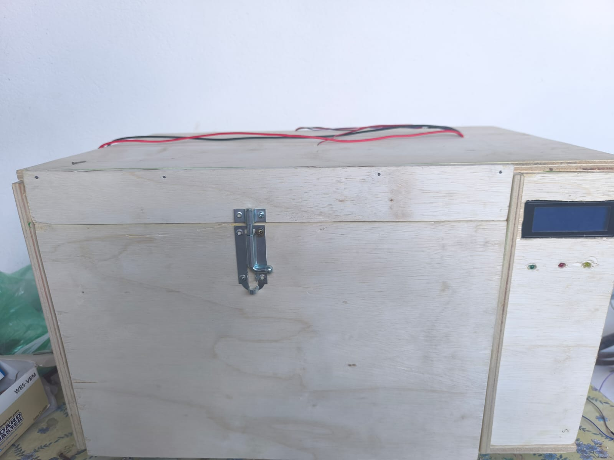

### Frente aberta com bandeja e sensor DHT22 visível
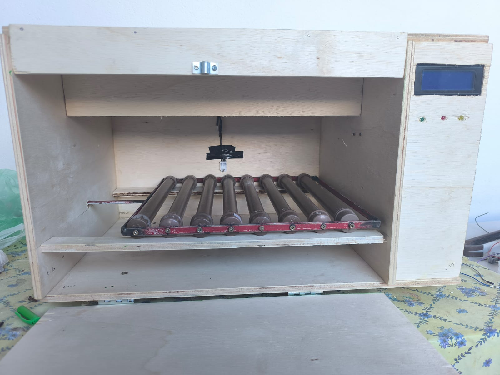

### Vista frontal alternativa
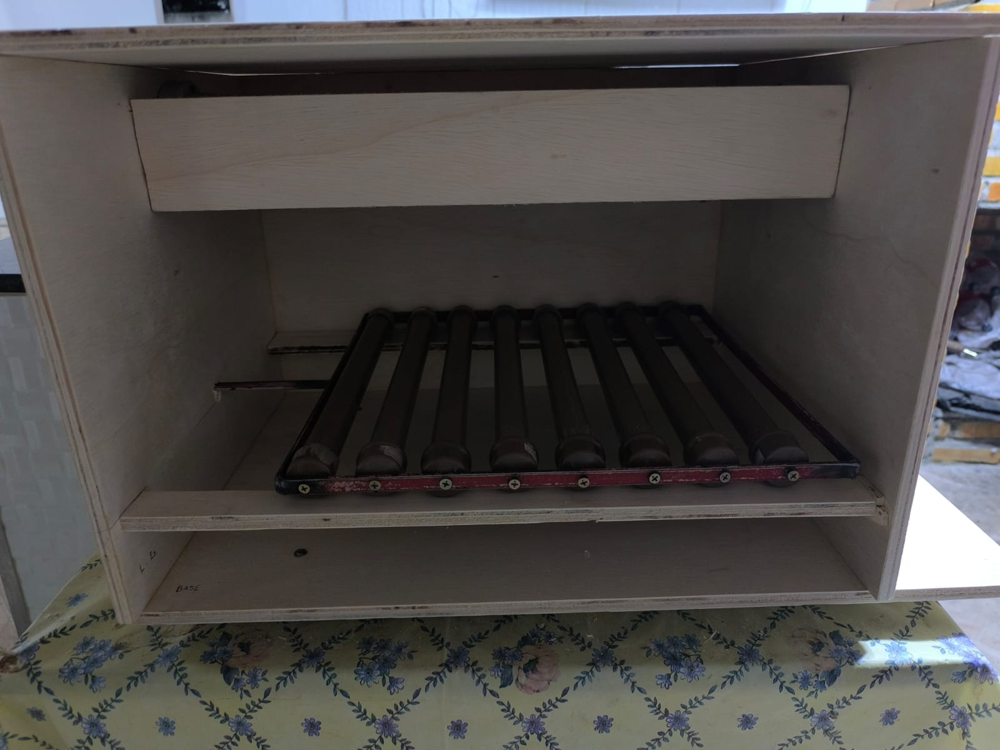

### Painel de controle — display LCD 20x4 e LEDs indicadores
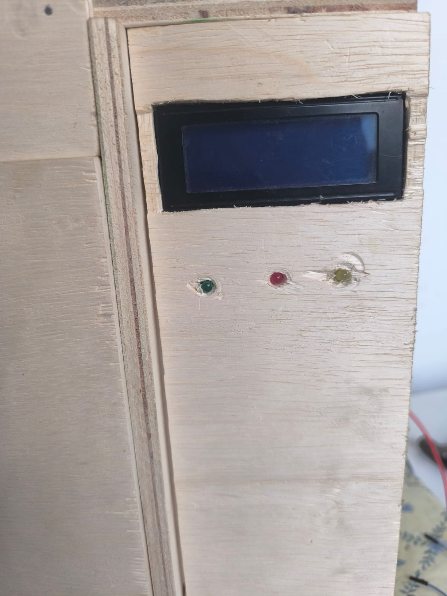

### Parte interna superior — lâmpadas, ventoinha e sensor DHT22
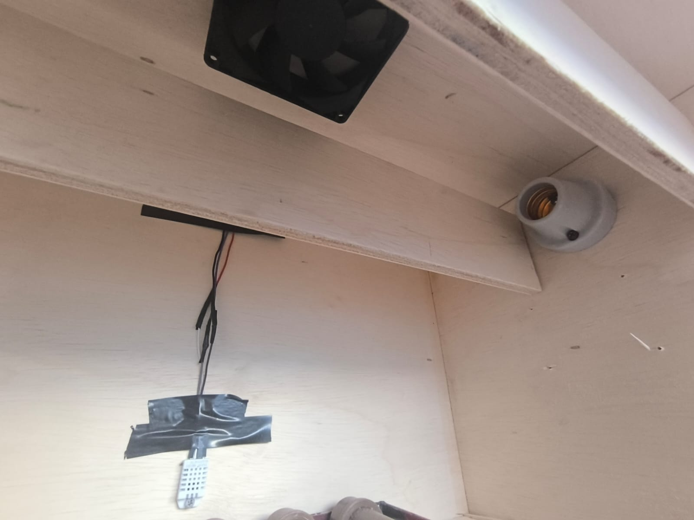

### Parte interna com lâmpadas acesas
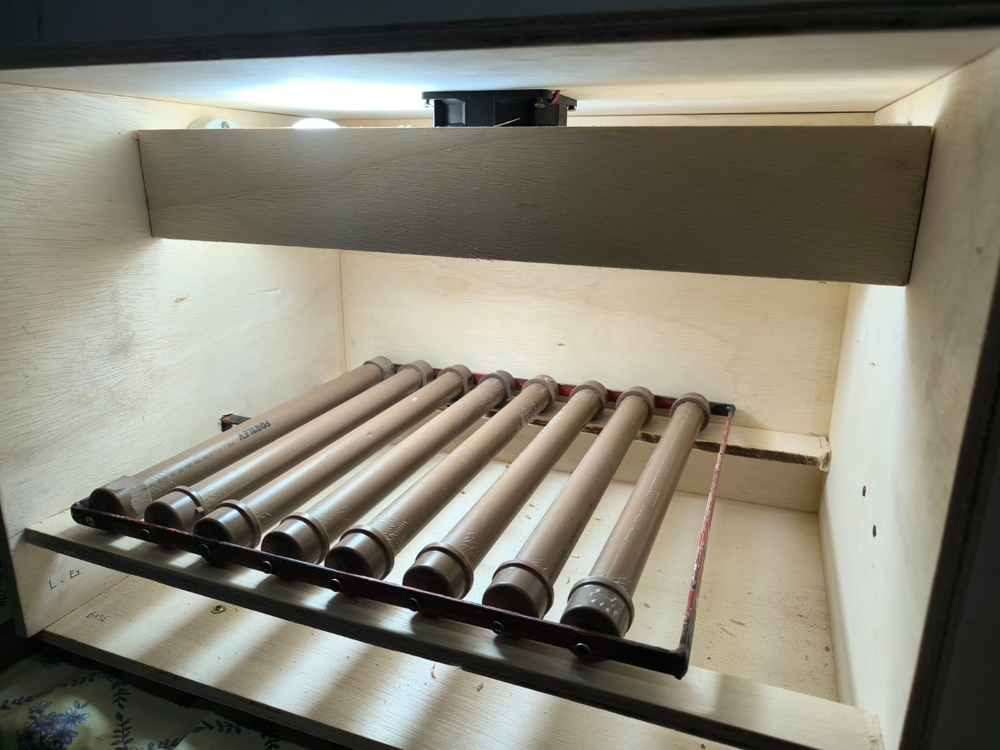

### Tampa superior aberta — soquetes e bandeja de rolagem
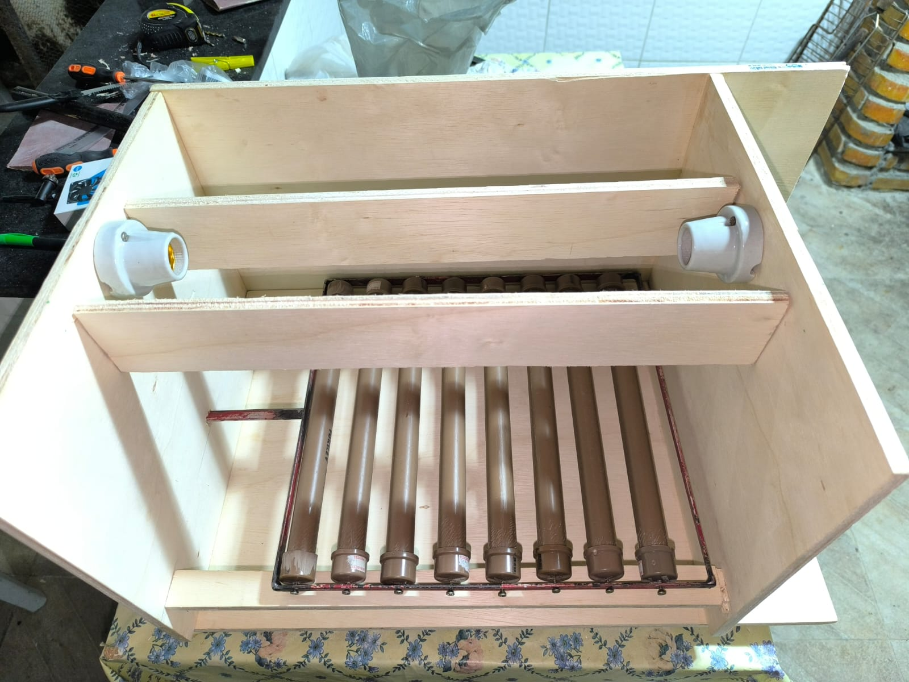

### Bandeja de rolagem com canos de PVC
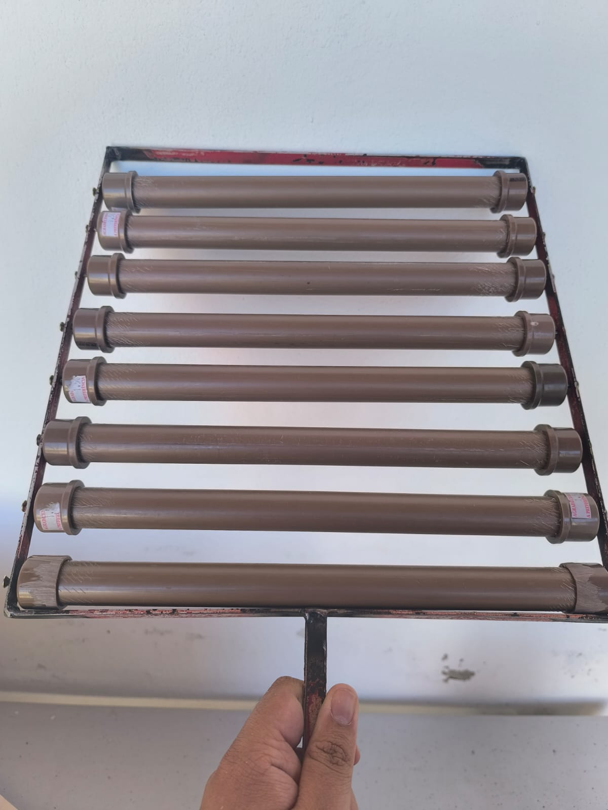

### Lateral do circuito — Arduino, relé, fonte e fiação
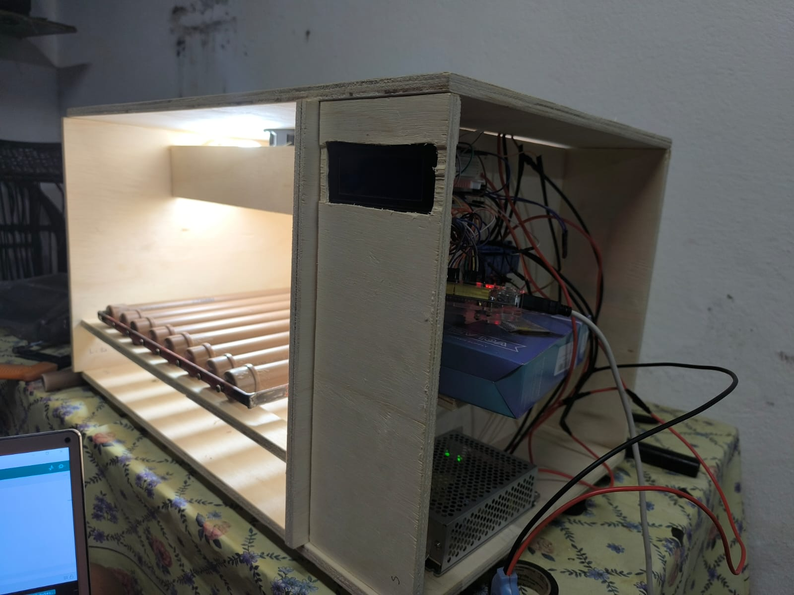

### Circuito montado
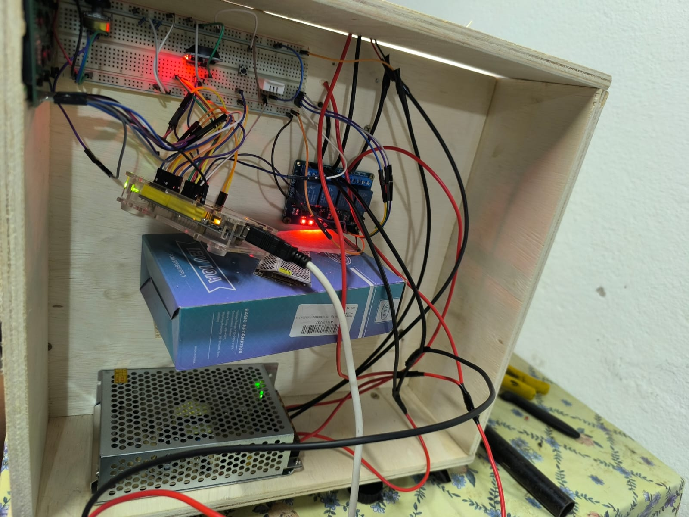

### Circuito montado — visão alternativa
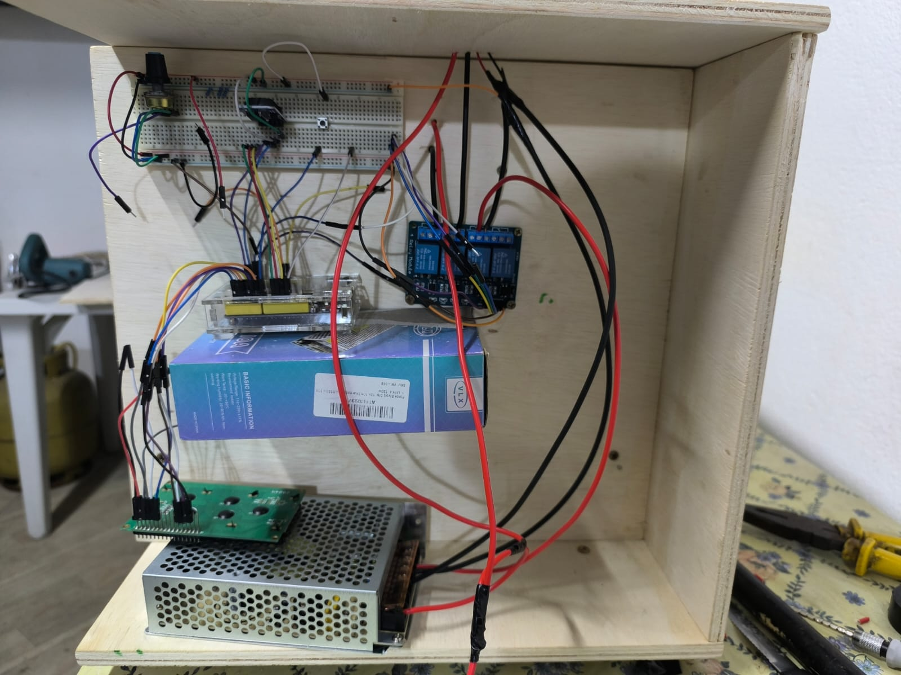

### Em construção — fase inicial da montagem
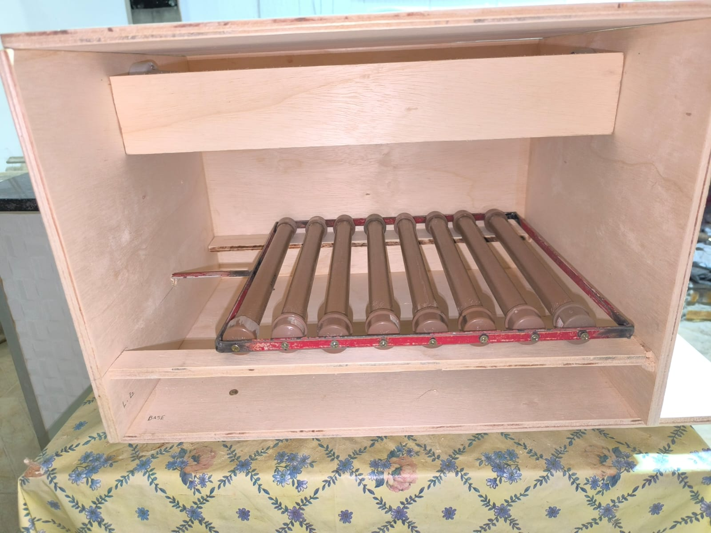

---

## 👨‍💻 Autor

**José Veríssimo de Oliveira Queiroz**

Bacharelado Interdisciplinar em Ciência e Tecnologia — UFERSA, Pau dos Ferros/RN  
📧 jose54143@gmail.com
📱 (84) 92144-5170